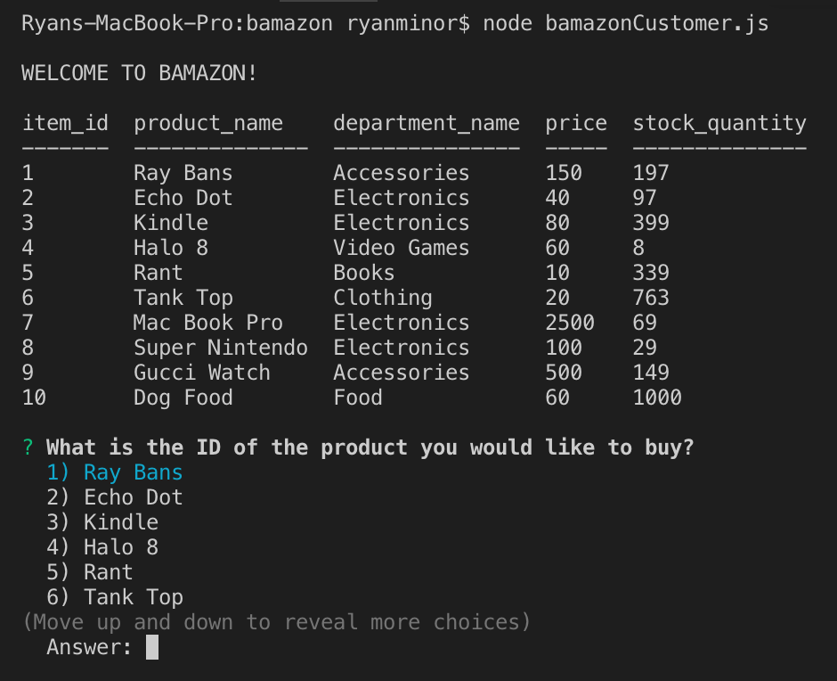
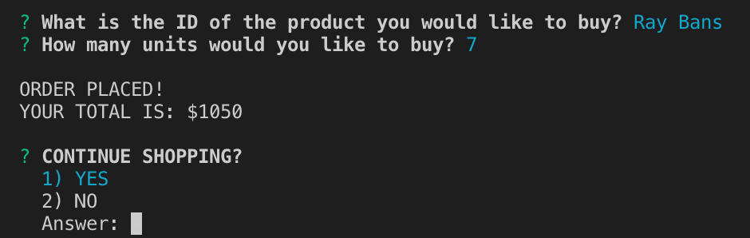
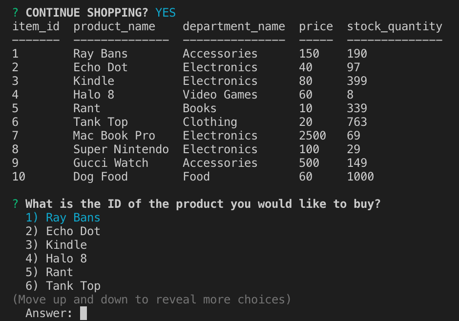
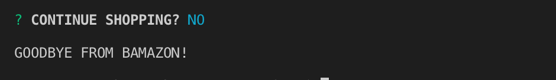

# Bamazon 

### Overview
In this program, I created an Amazon-like storefront with MySQL, Node.JS and Javascript. The app takes in orders from customers in the CLI and depletes stock from the store's inventory.

Make sure you save and require the MySQL and Inquirer npm packages before you run the node program because your app will need them for data input and storage.

Additionally, if you would like to see the stores inventory in a nicer table you will also need to install console.table with the command 'npm install console.table'.

### How to use Bamazon
Type 'bamazonCustomer.js' in the command line to run the program: 

The first thing you will see is a WELCOME TO BAMAZON! message followed by a table of all of the products that are being sold by Bamazon and includes the product name, department name, price as well as quantity available. 

The first prompt asks the ID of the item you would like to select. Either use the up or down arrows or enter a number. 

Immediately afterwards you will be asked the quantity of the item you selected to be purchased. 

Once you have entered your quantity you recieve a prompt that tells you that your order has been placed along with your total. 

After your order is placed you will be asked if you would like to continue shopping. If you say yes the Bamazon table will be displayed again with the updated stock. 

(In this example, the user purchased 7 pairs of Ray Bans and the stock_quantity went from 197 down to 190.) 

If the user does not wish to continue shopping, the connection to MySql will end and will recieve a "GOODBYE FROM BAMAZON" message.

To see this and other projects go to: https://ryanroyce.github.io/portfolio/